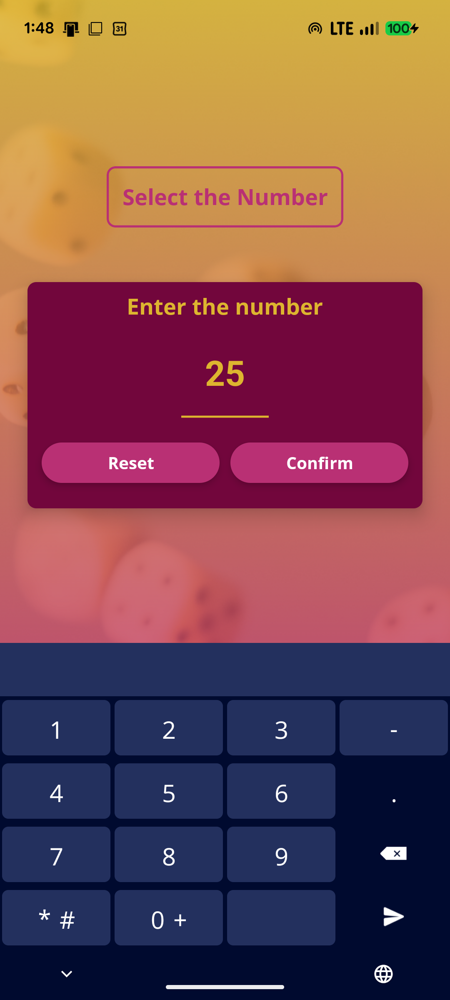
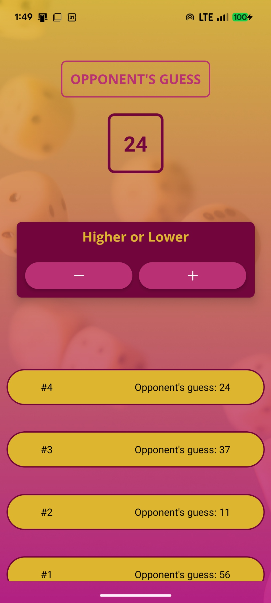

# 📱 Guess My Number Game

A fully responsive React Native mobile application where you choose a number, and the app's AI tries to guess it! 

Built with **React Native** and **Expo**, this project demonstrates modern React Native hooks, custom UI components, and dynamic layout adjustments for both Portrait and Landscape orientations.

## 📸 Screenshots

<p align="center">
  
  
  
</p>

## ✨ Features
* **Interactive Gameplay:** Set a number and give the phone "Higher" or "Lower" hints until it guesses correctly.
* **Fully Responsive Design:** The UI automatically completely reorganizes itself to provide the best user experience whether the phone is held vertically or horizontally.
* **Custom Components:** Reusable custom buttons, cards, and text components using StyleSheet.
* **Game Log:** A scrollable `FlatList` that keeps track of the phone's previous guesses.
* **Cross-Platform:** Works seamlessly on both Android and iOS devices.

## 🛠️ Technology Stack
* **Framework:** React Native
* **Environment:** Expo
* **Language:** JavaScript
* **Icons:** @expo/vector-icons (Ionicons)

## 🚀 How to Run Locally

1. **Clone the repository**
   ```bash
   git clone [https://github.com/KKPremarathna/guess-my-number.git](https://github.com/KKPremarathna/guess-my-number.git)

2. **Navigate to the directory**
   ```bash
   cd guess-my-number

3. **Install dependencies**
   ```bash
   npm install

4. **Start the Expo server**
   ```bash
   npx expo start

5. **Scan the QR code with the Expo Go app on your physical device, or press a to run on an Android emulator / i for an iOS simulator.**


